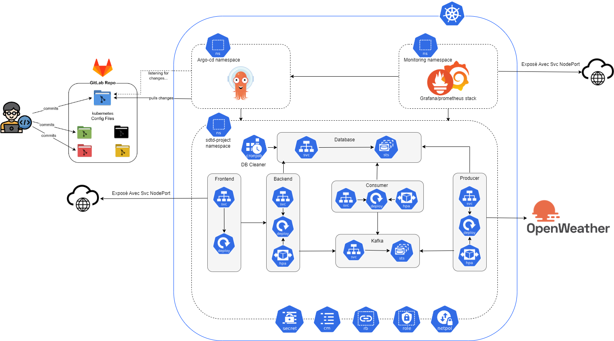

# Weather Forecast Application

## Overview

This project is a distributed application for real-time weather forecasting and wind power estimation. It provides users with current weather information and 5-day forecasts for any city worldwide, along with estimates of potential wind power generation.

## Features

- Real-time weather data and 5-day forecasts for global cities
- Wind power generation estimation based on weather conditions
- User-friendly interface for city search and data visualization
- Scalable distributed architecture
- Real-time data processing with Apache Kafka
- Caching mechanism for improved performance

## Technology Stack

### Backend
- Node.js with Express.js
- Python for data processing
- Apache Kafka for message queuing
- MongoDB

### Frontend
- React.js

### Infrastructure
- Docker for containerization
- Kubernetes for orchestration

## Project Structure

- `/frontend`: React.js frontend application
- `/backend`: Node.js backend service
- `/producer`: Python service for fetching weather data
- `/consumer`: Python service for processing weather data and calculating wind power
- `/k8s-manifests`: Kubernetes deployment manifests (monitored by ArgoCD)
- `/database-cleaner`: Script for periodic cleaning of the MongoDB cache

## CI/CD Pipeline

Our project uses a comprehensive CI/CD pipeline to ensure smooth and reliable deployments. The pipeline is split into two main parts:

### Continuous Integration (CI)

The CI pipeline is implemented using GitLab CI and consists of two main stages: build and deploy.

- Build Stage: 
  - Builds Docker images for each component (backend, frontend, producer, consumer)
  - Pushes the built images to Docker Hub
  - Images are versioned based on the SHA of the corresponding commit

- Deploy Stage:
  - Updates Kubernetes manifest files with the new Docker image versions

Only the jobs corresponding to the components affected by the latest commit to the "main" branch are activated.

### Continuous Deployment (CD)

The CD process is orchestrated by ArgoCD, which is deployed on our Kubernetes cluster.

- ArgoCD monitors the `/k8s-manifests` directory in this repository
- When changes are detected (following CI actions), ArgoCD pulls the changes and applies the updates to the Kubernetes cluster

For more details on the infrastructure setup and deployment process, please refer to our [infrastructure repository](https://github.com/Hamdane-yassine/weather-forecast-infra-repo).

## Kubernetes Deployment Architecture

Our Kubernetes deployment architecture includes:

- Deployments for stateless components (frontend, backend, producer, consumer)
- StatefulSets for stateful components (MongoDB, Kafka)
- Horizontal Pod Autoscalers (HPAs) for dynamic scaling
- ConfigMaps and Secrets for configuration management
- Network Policies for security
- Liveness and Readiness Probes for health checking
- NodePort Services for external access

## Database Management

### Database Cleaner

To ensure optimal performance and resource utilization, we've implemented a database cleaning mechanism:

- Location: The cleaning script is located in the `/database-cleaner` directory.
- Purpose: It removes outdated data from our MongoDB cache, as weather data is refreshed every 10 minutes according to the external API.
- Deployment: The cleaner is deployed as a Kubernetes CronJob, running every 10 minutes.

This approach helps us maintain a lean and efficient database, reducing unnecessary storage usage and potentially improving query performance.

## Scalability

The application is designed to scale horizontally. Kubernetes Horizontal Pod Autoscalers (HPAs) are configured for the backend, producer, and consumer services to automatically scale based on CPU utilization.

## Monitoring

The application uses Prometheus and Grafana for monitoring and visualization of metrics.

## Critical Analysis and Technical Challenges

### Scalability Issues
We encountered scalability issues with the Producer pod, which was duplicating rapidly under increased user load. This was initially due to limited CPU resources (100mCPU) allocated to the Producer pod. We resolved this by increasing the CPU allocation to 300mCPU and limiting the number of threads that could be created.

### Pending Cities Management
We faced challenges in managing cities that were in the process of being processed. To address this, we implemented a timestamp-based system in the "pendingCities" collection in MongoDB to prevent cities from being stuck in a pending state indefinitely.

### Kafka Partition Distribution
We encountered issues with inadequate distribution of Kafka partitions, leading to uneven load distribution among replicas. We resolved this by creating a new partition for each replica and implementing a custom task distribution system.

### Technology Choices Critique
- MongoDB: While flexible, it might be overqualified for our caching needs. A memory-based database like Redis could be more suitable.
- ArgoCD: Although powerful for CD, it has a relatively high resource footprint.
- Docker Hub: For private applications, a private container registry like Google Container Registry might be more appropriate.

## Future Perspectives

- Implement horizontal scalability for virtual machines
- Integrate HashiCorp Vault for enhanced security
- Improve monitoring with application-specific metrics and alerts

## Contributors

- FIALI Mouad
- GHAZAOUI Badr
- HAMDANE Yassine
- MAROUANE Kamal
- RIMAOUI Nabila
- ZARKTOUNI Ismail